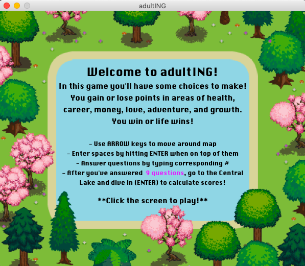
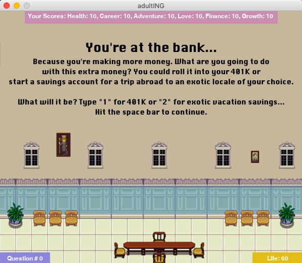
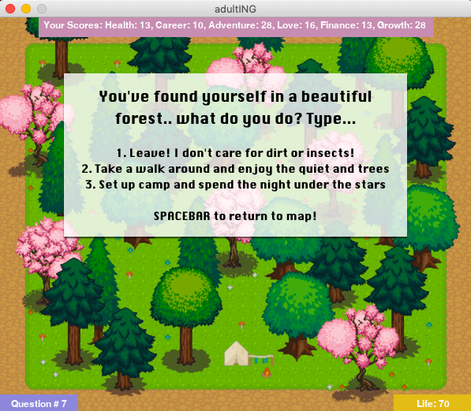
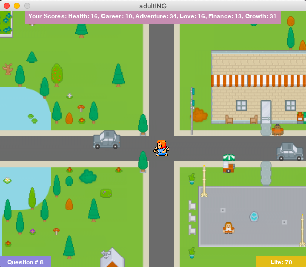
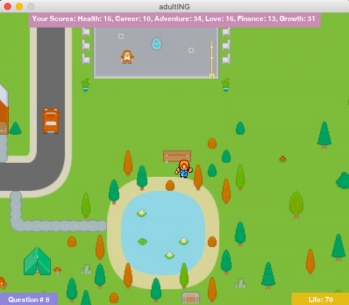
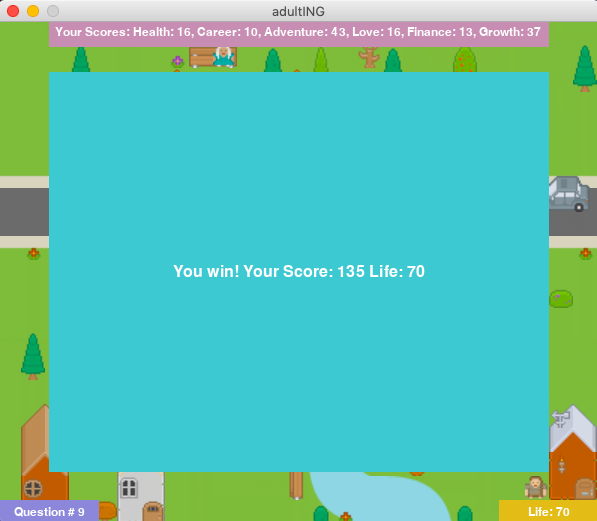

# adultING

# Description

A game made with Python and Pygame, resembling real-world choices, and their consequences :]

# Technologies
- Python
- Pygame
- Tiled
- Adobe Photoshop

# Screenshots from game play

